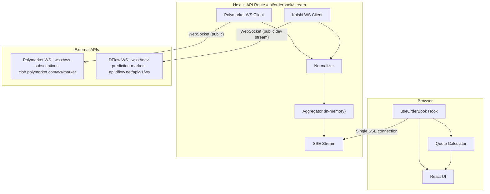

# Prediction Market Aggregator - Technical Plan

## Overview

Build a real-time prediction market aggregator with an all-backend architecture. Next.js API route connects to Polymarket WebSocket and DFlow WebSocket (for Kalshi market stream) server-side, normalizes and aggregates in-memory, and streams a single unified order book to the browser via SSE. Frontend is a pure display layer with a quote calculator.

---

## Architecture



---

## Data Flow and Normalization

**Key difference between venues:**

- **Polymarket**: Prices are 0-1 decimals (e.g., `"0.48"`). Provides both `bids` and `asks` arrays. Uses `asset_id` (token ID) per outcome. Public WebSocket, no auth.
- **Kalshi via DFlow**: Stream provides YES and NO bid books keyed by decimal prices; asks are implied (`1 - no_bid`).

**Normalization strategy**: Convert both to a common format with prices as decimals 0-1, explicit bids/asks, and venue tags on every level.

---

## Data Sources Strategy

Both venue connections live server-side in a single Next.js API route (`/api/orderbook/stream`):

- **Polymarket** (server-side WS client):
  - Connects to `wss://ws-subscriptions-clob.polymarket.com/ws/market` (public, no auth)
  - Receives `book` snapshots + `price_change` deltas
  - Sends `PING` every 10s for keepalive
  - Auto-reconnects with exponential backoff

- **Kalshi via DFlow** (server-side WS client):
  - Connects to `wss://dev-prediction-markets-api.dflow.net/api/v1/ws`
  - Subscribes to `orderbook` channel for ticker `KXPRESPERSON-28-JVAN`
  - No API key required in current setup
  - Auto-reconnects with exponential backoff

- **Aggregation** (in-memory):
  - Each venue updates its own normalized book in memory
  - On every update from either venue, re-merge into a combined book
  - Push the combined book + per-venue status to the browser via a single **SSE stream**

- **Browser**:
  - Single `EventSource` connection to `/api/orderbook/stream`
  - Receives pre-aggregated data -- no normalization or merging needed client-side

---

## Key TypeScript Types (`src/lib/types.ts`)

```typescript
type Venue = "polymarket" | "kalshi";

interface OrderBookLevel {
  price: number; // 0-1 decimal
  size: number; // number of shares/contracts
  venue: Venue;
}

interface VenueOrderBook {
  venue: Venue;
  bids: OrderBookLevel[];
  asks: OrderBookLevel[];
  lastUpdated: number | null;
  status: "connected" | "disconnected" | "connecting";
}

interface AggregatedOrderBook {
  bids: OrderBookLevel[]; // sorted descending by price
  asks: OrderBookLevel[]; // sorted ascending by price
  venues: Record<Venue, VenueOrderBook>;
}

interface QuoteResult {
  totalShares: number;
  avgPrice: number;
  fills: { venue: Venue; shares: number; price: number; cost: number }[];
  totalCost: number;
  unfilled: number;
}
```

---

## Key Design Decisions

- **All-backend architecture**: Both venue WebSockets live server-side. Server handles normalization + aggregation. Frontend is a pure display layer with one SSE connection.
- **Why server-side for both**: Consistent data pipeline, easier to test, connection sharing across browser tabs/clients, production-realistic pattern.
- **SSE to browser (not WebSocket proxy)**: SSE is simpler, auto-reconnects natively via `EventSource`, and is sufficient for server-to-client streaming. No bidirectional communication needed.
- **In-memory aggregation (no DB)**: Order book data is ephemeral and high-frequency. A database would add latency for data with zero long-term value.
- **Venue-tagged levels**: Every order book level carries its venue tag, enabling the combined/individual views and split calculations without separate data structures.
